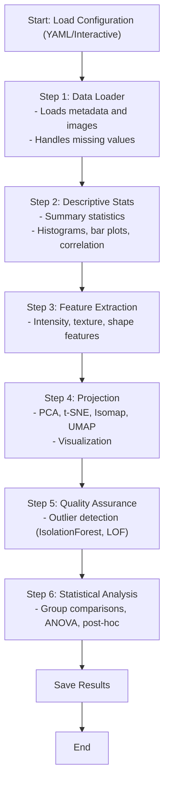

Ran tool
Ran tool
Read file: medical_analysis_pipeline.py
Read file: cli.py
Here is a comprehensive README in English, including **usage examples**, **detailed function documentation** for each main module, and a **pipeline flow diagram**.

---

# 🏥 Analisis-DB-iMedicas

A modular, configurable pipeline for medical image analysis and metadata processing, featuring feature extraction, descriptive statistics, projection, quality assurance, and statistical analysis.

---

## Table of Contents

- [Project Overview](#project-overview)
- [Project Structure](#project-structure)
- [Installation](#installation)
- [Configuration](#configuration)
- [Usage](#usage)
  - [CLI Example](#cli-example)
  - [Interactive Example](#interactive-example)
  - [Notebook Example](#notebook-example)
- [Pipeline Flow Diagram](#pipeline-flow-diagram)
- [Module and Function Documentation](#module-and-function-documentation)
  - [Pipeline Orchestration](#pipeline-orchestration)
  - [Step Modules](#step-modules)
- [Output and Results](#output-and-results)
- [Contributing](#contributing)
- [License](#license)

---

## Project Overview

This project implements a flexible pipeline for medical image and metadata analysis. It allows you to load data, clean and preprocess it, extract features, generate descriptive statistics, project data into lower-dimensional spaces, perform quality assurance, and conduct statistical analysis—all in a modular, configurable way using YAML files or an interactive CLI.

---

## Project Structure

```
Analisis-DB-iMedicas/
│
├── cli.py                      # Command-line interface (CLI) entry point
├── config_default.yaml         # Example pipeline configuration
├── data/                       # Input data (images and metadata)
├── example.ipynb               # Jupyter Notebook usage example
├── medical_analysis_pipeline.py# Interactive pipeline (console menu)
├── outputs/                    # Pipeline results and outputs
├── requirements.txt            # Project dependencies
├── src/
│   ├── pipeline.py             # Pipeline orchestration logic
│   ├── utils.py                # Utility functions (saving results, etc.)
│   └── steps/                  # Implementation of each pipeline step
│       ├── data_loader.py
│       ├── descriptive_stats.py
│       ├── feature_extraction.py
│       ├── projection.py
│       ├── quality_assurance.py
│       ├── statistical_analysis.py
│       └── base_step_.py
└── space/                      # (Optional) Other resources
```

---

## Installation

1. **Clone the repository:**
   ```bash
   git clone <REPO_URL>
   cd Analisis-DB-iMedicas
   ```

2. **(Optional) Create a virtual environment:**
   ```bash
   python -m venv venv
   source venv/bin/activate  # On Windows: venv\Scripts\activate
   ```

3. **Install dependencies:**
   ```bash
   pip install -r requirements.txt
   ```

---

## Configuration

The pipeline is configured via a YAML file. Use `config_default.yaml` as a template. Example:

```yaml
general:
  input_metadata_path: "data/mnist_medical_metadata.csv"
  input_images_dir: "data/mnist_medical_images/"
  output_dir: "outputs/mnist_experiment"

pipeline:
  - name: data_loader
    params:
      missing_values_strategy: "impute"
      impute_method: "median"
  - name: descriptive_stats
    params:
      group_by_variable: "diagnosis"
  - name: feature_extraction
    params:
      strategies: [intensity, texture]
  - name: projection
    params:
      methods: [pca, tsne, isomap]
      color_by_variable: "diagnosis"
  - name: quality_assurance
    params:
      method: "IsolationForest"
  - name: statistical_analysis
    params:
      group_by_variable: "diagnosis"
      continuous_variables: ["intensity_mean", "texture_contrast"]
```

---

## Usage

### CLI Example

Run the pipeline using a configuration file:

```bash
python cli.py run --config-file config_default.yaml
```

Override the output directory if needed:

```bash
python cli.py run --config-file config_default.yaml --output-dir outputs/my_experiment
```

### Interactive Example

Launch the interactive pipeline (step-by-step configuration):

```bash
python medical_analysis_pipeline.py
```

### Notebook Example

See `example.ipynb` for a Jupyter-based workflow.

---

## Pipeline Flow Diagram



---

## Module and Function Documentation

### Pipeline Orchestration

#### `src/pipeline.py`

- **class Pipeline**
  - **`__init__(self, config)`**: Initializes the pipeline with a configuration dictionary.
  - **`run(self)`**: Iterates through the pipeline steps defined in the config, dynamically imports and executes each step, and saves the final output.

#### `cli.py`

- **CLI entry point using [Typer](https://typer.tiangolo.com/):**
  - **`run(config_file, output_dir=None)`**: Loads the YAML config, optionally overrides the output directory, and runs the pipeline.

#### `medical_analysis_pipeline.py`

- **class MedicalAnalysisPipeline**
  - **`__init__(self)`**: Initializes interactive config and state.
  - **`configure_pipeline(self)`**: Guides the user through step-by-step pipeline configuration.
  - **`execute_pipeline(self)`**: Runs each pipeline step, imports modules dynamically, and saves results.
  - **`run(self)`**: Main entry point for the interactive pipeline; calls configuration, summary, execution, and visualization.

---

### Step Modules

All steps inherit from `BaseStep` and must implement `run()`.

#### `src/steps/data_loader.py`

- **class DataLoader(BaseStep)**
  - **`run(self)`**: Loads metadata (CSV/Excel), handles missing values (drop or impute), associates images, and returns a DataFrame.

#### `src/steps/descriptive_stats.py`

- **class DescriptiveStats(BaseStep)**
  - **`run(self)`**: Generates summary statistics, histograms, bar plots, grouped boxplots, and correlation matrices. Saves results to the output directory.

#### `src/steps/feature_extraction.py`

- **class FeatureExtraction(BaseStep)**
  - **`run(self)`**: Extracts features from images using selected strategies (`intensity`, `texture`, `shape`). Saves intermediate and final feature tables and a report.
  - **Feature strategies:**
    - **IntensityFeatures**: Mean, std, skewness, kurtosis of pixel intensities.
    - **TextureFeatures**: GLCM-based texture features (contrast, dissimilarity, etc.).
    - **ShapeFeatures**: Area, perimeter, circularity, aspect ratio, solidity.

#### `src/steps/projection.py`

- **class Projection(BaseStep)**
  - **`run(self)`**: Projects features into lower-dimensional spaces using PCA, t-SNE, Isomap, or UMAP. Generates and saves 2D/3D visualizations, distance/correlation matrices, and reports.

#### `src/steps/quality_assurance.py`

- **class QualityAssurance(BaseStep)**
  - **`run(self)`**: Detects outliers using Isolation Forest or Local Outlier Factor. Adds an `is_anomaly` column and saves anomaly labels.

#### `src/steps/statistical_analysis.py`

- **class StatisticalAnalysis(BaseStep)**
  - **`run(self)`**: Performs group comparisons (ANOVA, t-test, non-parametric tests), post-hoc analysis, and saves statistical reports.

#### `src/utils.py`

- **`save_results(output_dir, filename, data)`**: Utility to save DataFrames, Series, or dicts as CSV or JSON in the specified output directory.

---

## Example: Custom Pipeline Step

Suppose you want to add a new step called `custom_analysis.py`:

```python
from src.steps.base_step_ import BaseStep

class CustomAnalysis(BaseStep):
    def run(self):
        # Your custom logic here
        return self.data
```

Add it to your YAML config:

```yaml
pipeline:
  ...
  - name: custom_analysis
    params: {}
```

---

## Output and Results

Results are saved in the `outputs/` directory, organized by analysis type:

- `descriptive_stats/`: Statistics, histograms, plots.
- `features/`: Extracted features.
- `projection/`: Projections, distance/correlation matrices.
- `quality_assurance/`: Outlier labels.
- `statistical_analysis/`: Statistical reports.
- `final_output.csv`: Final pipeline output.

---

## Contributing

Contributions are welcome! Please open an issue or pull request for suggestions, improvements, or bug reports.

---

## License

[MIT License](LICENSE) (or as appropriate)

---

### Example CLI Usage

```bash
python cli.py run --config-file config_default.yaml
```

### Example Interactive Usage

```bash
python medical_analysis_pipeline.py
```


---